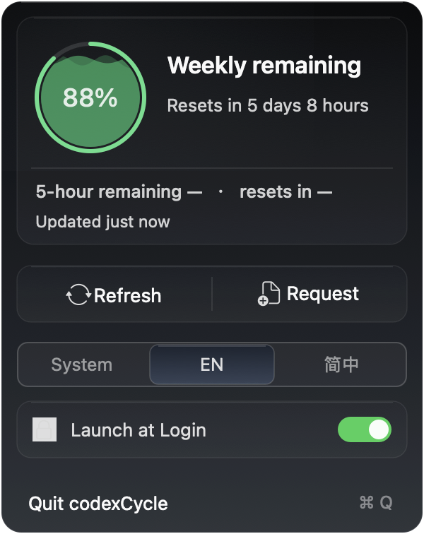

<p align="center">
  
</p>

<h1 align="center">codexCycle</h1>

<p align="center">
  一款原生 macOS 状态栏应用，随时查看 Codex 5 小时和周余量。
</p>

<p align="center">
  <a href="README.md">English</a> ·
  <a href="README.zh-CN.md"><strong>简体中文</strong></a>
</p>

<p align="center">
  <a href="https://github.com/Crucifixion-Fxl/codexCycle/releases/latest"></a>
  
  
  
</p>

<p align="center">
  <a href="https://github.com/Crucifixion-Fxl/codexCycle/releases/latest"><strong>下载最新版 DMG</strong></a>
</p>

<p align="center">
  
</p>

## 主要功能

- 在一个紧凑面板中显示 Codex 的 5 小时和 7 天限额窗口。
- 在 macOS 状态栏持续显示当前主要窗口的剩余百分比。
- 以动态水位呈现主要窗口的剩余额度，同时保留精确百分比数字。
- 启动、唤醒、限额变化、重置边界和每 5 分钟自动刷新。
- 每天早上七点发起一次最小 Codex 请求，用于启动或滚动 5 小时窗口。
- 面板内提供刷新和立即请求，无需打开终端或浏览器。
- 支持跟随系统、English 和简体中文三种界面语言选择。
- 通过面板内开关直接启用或关闭登录时启动。
- 不保存凭据，不收集分析数据，也不发送遥测。

## 显示规则

| 可用限额窗口 | 状态栏指示器 | 面板主要读数 | 次要读数 |
| --- | --- | --- | --- |
| 5 小时和周窗口 | 5 小时 | 5 小时 | 周窗口 |
| 仅周窗口 | 周窗口 | 周窗口 | 5 小时不可用 |
| 仅 5 小时窗口 | 5 小时 | 5 小时 | 周窗口不可用 |
| 均不可用 | 不可用 | 不可用 | 不可用 |

剩余限额按照 `floor(100 - usedPercent)` 计算，并限制在 `0...100`。
重置倒计时最多显示两个时间单位，不显示秒。普通刷新失败时，有效缓存会以灰色继续
显示，并在自身重置边界到达时失效。

动态水位高度对应剩余额度百分比，中央数字和外圈仍然可见。颜色使用固定的红、黄、
绿刻度，`0` 为红色，`20` 为黄色，`50` 到 `100` 为绿色。开启“减少动态效果”时
水面保持静止。

## 环境要求

- Apple Silicon Mac
- macOS 13 或更高版本
- 一个已经登录的 Codex Runtime
  - 独立 Codex CLI
  - 当前 ChatGPT 桌面应用中的 Codex

## 安装

1. 从 [GitHub Releases](https://github.com/Crucifixion-Fxl/codexCycle/releases/latest) 下载最新版 arm64 DMG。
2. 打开 DMG。
3. 将 `codexCycle.app` 拖入 `Applications`。
4. 启动 `codexCycle`，从状态栏打开面板。

公开构建使用 ad hoc 签名，尚未经过 Apple 公证。macOS 首次启动时可能要求在
**系统设置 → 隐私与安全性 → 仍要打开** 中确认。请只安装本仓库发布的版本。

## 日常使用

- 点击状态栏指示器打开或关闭二级面板。
- 使用“刷新”读取最新限额状态。
- 使用“请求”运行一次最小 Codex 对话，并刷新两个窗口。
- 使用语言选择器跟随 macOS，或明确选择 English 和简体中文。
- 使用“登录时启动”开关直接注册或取消登录项。
- 使用“退出 codexCycle”或 `⌘ Q` 停止当前进程。

每天早上七点的计划请求和手动“请求”都会消耗少量 Codex 限额。读取当前限额
不会启动模型任务。

## Runtime 与隐私

`codexCycle` 会寻找兼容的本地 Runtime，并通过 `codex app-server --stdio`
通信。应用读取 `account/rateLimits/read`，同时监听限额更新通知。运行前会检查
Runtime 的所有者、权限、可执行文件形式和代码签名。

应用不会进行以下操作。

- 读取、复制、保存、显示或记录 Codex 凭据
- 直接向 Codex 服务发起网络请求
- 收集分析数据、遥测或崩溃报告
- 提供登录流程或自动更新器

每日及手动请求会运行临时 `codex exec` 会话，使用只读 sandbox，忽略用户配置，
并设有 90 秒超时。

## 从源码构建

项目使用 Xcode、Swift 和 AppKit，不依赖第三方软件包。

```sh
make build      # 构建 Debug 应用
make test       # 运行 XCTest 测试
make release    # 构建并本地签名 Release 应用
make dmg        # 生成 dist/codexCycle-<版本>-arm64.dmg
make install    # 替换 /Applications/codexCycle.app 并启动
make uninstall  # 删除应用并保留偏好设置
make purge      # 删除应用及其偏好设置
```

## 项目结构

| 路径 | 职责 |
| --- | --- |
| `codexCycle/Domain` | 限额模型、窗口选择和剩余量计算 |
| `codexCycle/Infrastructure` | Runtime 发现、app-server 通信、缓存和登录项管理 |
| `codexCycle/Coordination` | 刷新调度、重试、唤醒处理和每日请求 |
| `codexCycle/Presentation` | 状态栏指示器、二级面板、本地化和相对时间 |
| `codexCycleTests` | 解析、缓存、Runtime、调度、界面和回归测试 |
| `docs/adr` | 架构决策和运行约束 |

## 常见问题

| 现象 | 处理方法 |
| --- | --- |
| 未找到 Codex Runtime | 安装 Codex CLI，或安装并登录当前 ChatGPT 桌面应用 |
| Codex Runtime 不兼容 | 更新 Codex CLI 或 ChatGPT，然后选择“刷新” |
| Codex 尚未登录 | 通过对应的 Codex 产品完成登录 |
| 登录时启动处于关闭状态 | 在 codexCycle 面板中打开“登录时启动” |
| macOS 阻止首次启动 | 在“隐私与安全性”中选择“仍要打开” |

已安装的应用提供只读诊断命令。

```sh
/Applications/codexCycle.app/Contents/MacOS/codexCycle --diagnose
```

## 文档

- [产品规格](docs/product-spec.md)
- [Codex app-server 决策](docs/adr/0001-use-codex-app-server-for-rate-limits.md)
- [非沙盒 Runtime 决策](docs/adr/0002-run-outside-the-app-sandbox.md)
- [Runtime 发现与信任决策](docs/adr/0003-support-independent-and-desktop-codex-runtimes.md)
- [每日请求决策](docs/adr/0004-use-ephemeral-codex-exec-for-daily-five-hour-refresh.md)

## 参与贡献

欢迎提交 Issue 和范围清楚的 Pull Request。提交前请运行 `make test`，行为变更应与
产品规格和架构决策保持一致。
